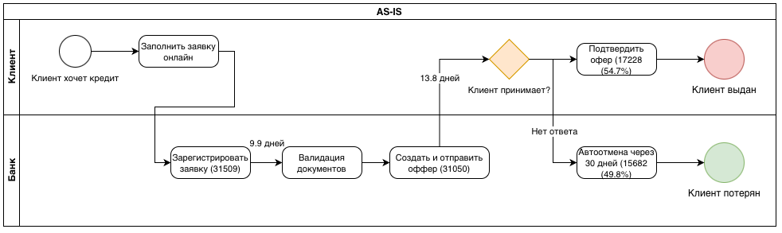
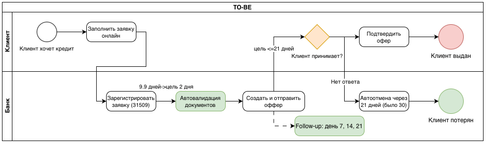

# Loan Process Analytics

Анализ процесса выдачи кредита по логу голландского банка. Цель — найти узкие места: где заявки задерживаются и где теряются клиенты.

## Данные

[BPI Challenge 2017](https://doi.org/10.4121/uuid:5f3067df-f10b-45da-b98b-86ae4c7a310b) — открытый событийный лог от Eindhoven University of Technology. Реальные заявки на кредит и события по ним за 2016 год и январь 2017.

- 31 509 заявок
- 1 202 267 событий
- Три типа событий: действия по заявке (A_*), задачи сотрудников (W_*), работа с офферами (O_*)

## Методология

- Process mining через `pm4py`
- Анализ длительности заявок и переходов между этапами
- Воронка построена по событиям с офферами, а не по финальным статусам — в этом логе почти все заявки помечены `A_Complete`, что не отражает реальных потерь
- Сравнение запрошенной и предложенной суммы
- Диаграммы AS-IS и TO-BE в BPMN

## Результаты

**Длительность.** Медиана — 19 дней, среднее — 22 дня, максимум — 286 дней. Треть заявок закрывается дольше 31 дня.

**Воронка.** Оффер отправлен 31 050 заявкам, принят — 17 228 (54.7%). Остальные 45% отменяются автоматически через 30 дней без ответа.

**Узкие места:**
1. Валидация документов — 9.9 дней (ручная)
2. Ожидание решения клиента — 13.8 дней
3. Автоотмена через 30 дней — основная точка потерь

## AS-IS → TO-BE

| | AS-IS | TO-BE |
|---|---|---|
| Валидация документов | Ручная, 9.9 дней | Автоматическая, цель 2 дня |
| Напоминания клиенту | Нет | 7-й, 14-й, 21-й день |
| Срок автоотмены | 30 дней | 21 день |

**AS-IS**

**TO-BE**

## Рекомендации

- Автоматизировать первичную валидацию документов
- Добавить follow-up напоминания на 7-й, 14-й, 21-й день после отправки оффера
- Сократить срок автоотмены с 30 до 21 дня с более активной коммуникацией

## Структура

